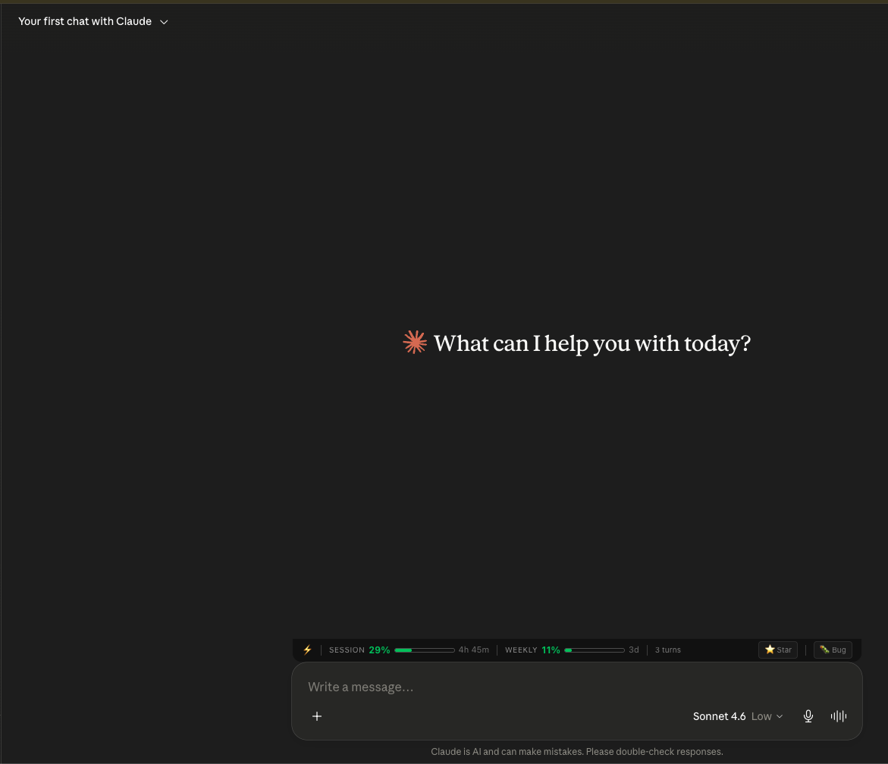
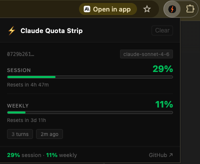
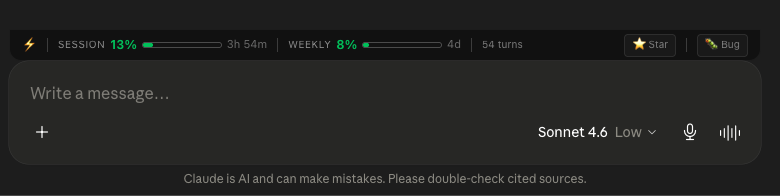

# ⚡ Claude Quota Strip

> Real-time Claude session & weekly quota tracker — injected as a strip directly above the claude.ai input box.


---

## Preview

### Toolbar strip — always visible above your prompt


### Popup — click the ⚡ icon for session breakdown


---

## What it looks like

The extension injects a persistent toolbar above the claude.ai message input:



And a popup when you click the extension icon showing per-session breakdowns with progress bars and reset timers.

---

## Features

- 📊 **Session usage %** with progress bar and reset countdown
- 📅 **Weekly usage %** with progress bar and reset countdown
- 🔄 **Turn counter** per conversation
- 🔀 **Conversation-aware** — updates when you switch chats
- 🌗 **Dark / light theme** auto-detection
- ⭐ **Star** and 🐛 **Bug report** shortcuts in the strip
- 🔒 **100% local** — no data ever leaves your browser
- ✅ **Accurate** — reads directly from claude.ai's own API response

---

## Install from source (free, 3 steps)

### Prerequisites
- [Node.js](https://nodejs.org/) v18+
- Google Chrome

```bash
# 1. Clone
git clone https://github.com/Vydyam/claude-quota-strip.git
cd claude-quota-strip

# 2. Build
npm install && npm run build

# 3. Load in Chrome
# Go to chrome://extensions → Enable Developer mode → Load unpacked → select dist/
```

Then visit [claude.ai](https://claude.ai) — the strip appears automatically above the input box.

---

### Project structure


### How it works

claude.ai page loads
↓
injector.js (MAIN world) overrides window.fetch
↓
Intercepts SSE stream from /api/organizations/.../completion
↓
Captures message_limit event → session %, weekly %, reset times
↓
Dispatches custom DOM event → content-script.js
↓
Updates toolbar strip + stores session in chrome.storage.local
↓
Popup reads from storage on click

---

## Development

```bash
npm run dev      # Watch mode — rebuilds on save
npm run build    # Production build
npm run lint     # Lint
```

---

## Contributing

Contributions welcome! See [CONTRIBUTING.md](CONTRIBUTING.md).

### Good first issues
- [ ] Firefox support (`browser.*` API + sidebar_action)
- [ ] Configurable toolbar position (top / above input / floating)
- [ ] Settings panel — show/hide individual metrics
- [ ] Collapse/dismiss strip with timer (4h / 8h / 12h)
- [ ] Export session history as CSV
- [ ] Notifications when approaching 80% / 90% limits

---

## Privacy

All data stays in your browser. No analytics, no telemetry, no external requests.  
Read the full [Privacy Policy](https://vydyam.github.io/claude-quota-strip/privacy-policy).

---

## License

MIT © [Vydyam](https://github.com/Vydyam)

---

*Built in one session as an open source project. Star ⭐ if it's useful!*
